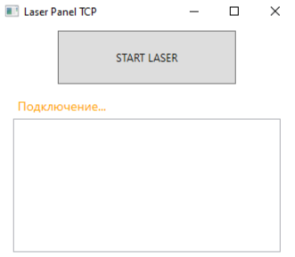
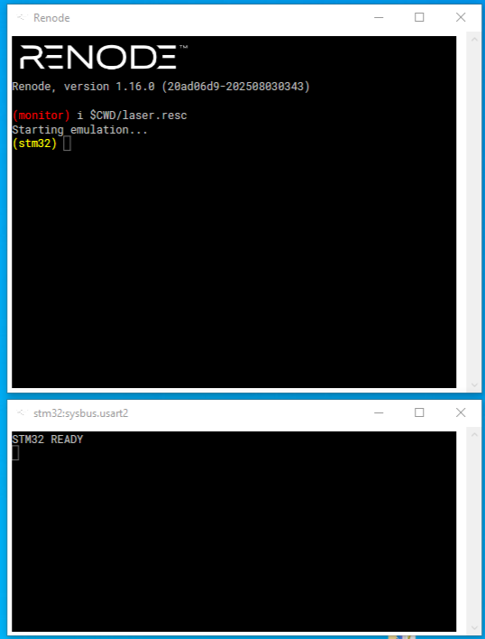
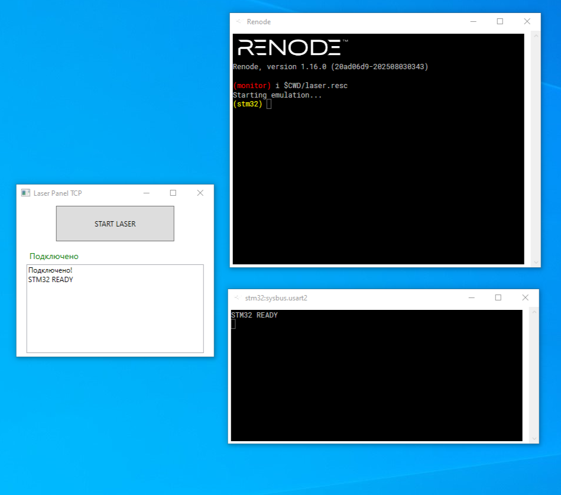
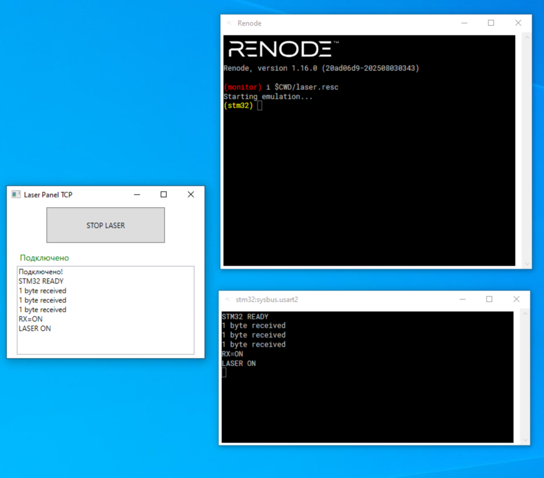
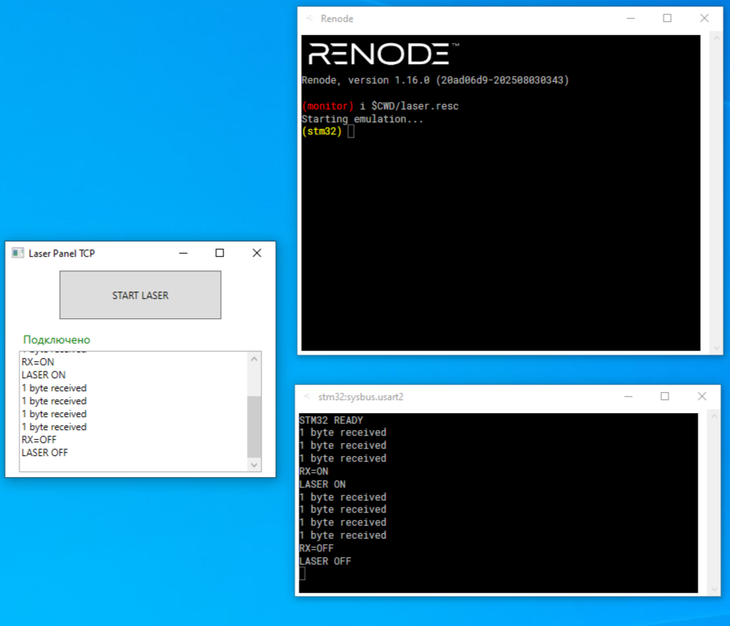

# Управление лазером через TCP и STM32

Проект демонстрирует управление лазером с ПК через TCP и эмулятор STM32 (Renode), с использованием STM32F103 и GPIO PA5.  


## Скриншоты проекта

Главное окно C# приложения:  


Терминал Renode с выводом UART:  


Терминал Renode и C# приложение:  


Лазер включён:  


Лазер выключен:  



---

## 📦 Структура репозитория
```
LaserControl/
├─ CSharpApp/ # Приложение на C# (WPF)
│ ├─ LaserPanel1.sln
│ └─ LaserPanel1/...
├─ STM32/ # Проект STM32
│ └─ STM32F103C8
│   └─ STM32F103C8_Laser.ioc
│   └─ STM32CubeIDE/ # Сгенерированный код для IDE
│     └─ Debug/
│       └─ STM32F103C8.elf 
├─ Renode/ # Скрипты для эмулятора
│ └─ laser.resc
└─ README.md

```


---

## 🛠 Используемые инструменты

- **Visual Studio** (C# WPF) — интерфейс и TCP клиент
- **STM32CubeMX** — настройка пинов и UART
- **STM32CubeIDE 2.0.0** — сборка кода для STM32
- **Renode Emulator** — эмуляция STM32 и UART через TCP

---

## 🔌 Архитектура проекта
**ПК (C#) → TCP → Renode → UART2 → STM32F103 → GPIO PA5 → Лазер**


- C# WPF приложение отправляет команды `ON/OFF`
- Renode эмулирует STM32 и передает команды через UART
- STM32 включает/выключает лазер (GPIO PA5)
- Ответы и логи возвращаются обратно в C# приложение

---

## 💻 Приложение на C#

- TCP клиент с автоподключением
- Кнопка **START / STOP** для управления лазером
- Асинхронный приём логов от STM32
- Интерфейс WPF: кнопка, статус соединения, окно логов

---

## 🖥 STM32

- **PA5** — GPIO Output (лазер)
- **PA2/PA3** — USART2 TX/RX
- Скорость UART: 115200 бод
- Команды:
  - `ON` — включить лазер
  - `OFF` — выключить лазер

- Код STM32 управляет лазером через GPIO и отправляет логи через UART.  

---

## ⚡ Renode

- Эмулятор STM32F103
- TCP Socket Terminal для связи с C# приложением
- Используется для тестирования без физического микроконтроллера

Пример скрипта `laser.resc` (универсальный, относительные пути):

```resc
mach create "stm32"
machine LoadPlatformDescription @platforms/cpus/stm32f103.repl
sysbus LoadELF @../STM32/STM32CubeIDE/Debug/STM32F103C8.elf
emulation CreateServerSocketTerminal 12345 "term" false
connector Connect sysbus.usart2 term
showAnalyzer sysbus.usart2
start

## Запуск

1. Компилируем STM32 проект в STM32CubeIDE (`start1.elf`)
2. Запускаем Renode:
   ```bash
  renode laser.resc 
  
## Сборка приложения

1. `LaserPanel1.sln` в Visual Studio.
2. Конфигурацию `Release`.
3. Build → Build Solution.
4. Файл `.exe` в:
   `CSharpApp\LaserPanel1\bin\Release\LaserPanel1.exe`